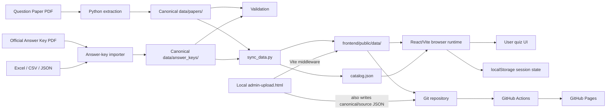

# Question Paper Navigator — Technical Architecture & Safe Change Guide

**Baseline inspected:** current `question-paper-platform-task2-upload-ui.zip` codebase (the package that was run locally with Vite).

## 1. Purpose

This document is the long-lived technical handoff for the Question Paper Navigator project. It is designed for:

- new developers who need to understand the code without reverse-engineering the repository from scratch;
- future contributors adding features without changing the quiz/data contract accidentally;
- LLM coding agents that need a compact but authoritative context before editing files;
- reviewers who need to distinguish the intended architecture from current implementation gaps.

The project is intentionally **GitHub-backed and SQL-free at runtime**. The public application reads static JSON and assets. Git is the version/history layer. Local browser storage is used only for user session state and preferences.

> **Source of truth rule:** when this document conflicts with actual code, the code is the immediate implementation truth. When actual behavior is unsafe or inconsistent with the documented contract, record the discrepancy in the change/issue log before changing it.

---

## 2. Executive Architecture



### Core principle

There are two distinct data layers:

1. **Canonical authoring/repository layer** — `data/`.
2. **Runtime static serving layer** — `frontend/public/data/`.

The processor script `sync_data.py` is the bridge between them. Do not manually edit both copies and expect them to remain synchronized.

---

## 3. Technology Stack

| Layer | Technology | Role |
|---|---|---|
| UI | React 19 | Component-based quiz UI |
| UI library | Material UI 7 | Layout, dialogs, controls, accessibility primitives |
| Bundler/dev server | Vite 7 | Local dev server and production build |
| Browser persistence | localStorage wrapper | Selected booklet, language, current index, responses, review flags, theme, demo flag |
| Offline processor | Python + PyMuPDF | PDF extraction and structural reconstruction |
| OCR fallback | pytesseract + Tesseract | Fallback for image-only PDF pages |
| Canonical storage | Git repository JSON | Versioned content store; no SQL database |
| Static hosting | GitHub Pages | Public read-only runtime |
| CI/CD | GitHub Actions | Install/build/deploy |
| Tests | Vitest + pytest | Frontend helper tests + processor tests |

---

## 4. Repository Map

```text
question-paper-platform/
│
├── frontend/
│   ├── index.html
│   ├── admin-upload.html
│   ├── package.json
│   ├── vite.config.js
│   ├── public/
│   │   ├── data/
│   │   │   ├── catalog.json
│   │   │   └── <BOOKLET>/
│   │   │       ├── questions.json
│   │   │       ├── answer_key.json
│   │   │       ├── paper.json
│   │   │       ├── validation.json
│   │   │       └── metadata.json (when present)
│   │   └── assets/
│   └── src/
│       ├── main.jsx
│       ├── App.jsx
│       ├── admin-upload.jsx
│       ├── components/
│       │   ├── Header.jsx
│       │   ├── Sidebar.jsx
│       │   ├── QuestionCard.jsx
│       │   ├── SettingsDialog.jsx
│       │   └── SourceDialog.jsx
│       ├── lib/
│       │   ├── data.js
│       │   ├── storage.js
│       │   ├── adminUpload.js
│       │   ├── data.test.js
│       │   └── adminUpload.test.js
│       └── theme/theme.js
│
├── processor/
│   ├── requirements.txt
│   ├── src/
│   │   ├── extract_paper.py
│   │   ├── import_answer_key.py
│   │   ├── validate_dataset.py
│   │   └── sync_data.py
│   └── tests/
│       ├── test_extract_paper.py
│       └── test_import_answer_key.py
│
├── data/
│   ├── papers/<BOOKLET>/
│   ├── answer_keys/<BOOKLET>/
│   ├── assets/<BOOKLET>/
│   └── README.md
│
├── source/
│   └── <BOOKLET>/ raw source PDFs / answer sheets
│
├── exports/
├── docs/
│   ├── ARCHITECTURE.md
│   ├── DECISIONS.md
│   └── TEST_MATRIX.md
│
├── .github/workflows/deploy.yml
├── package.json
└── README.md
```

---

## 5. Runtime Loading Contract — Do Not Break

`frontend/src/App.jsx` loads:

```text
./data/catalog.json
↓
./data/<booklet>/questions.json
./data/<booklet>/answer_key.json
./data/<booklet>/paper.json
```

The selected paper is discovered from `catalog.json` by `booklet_code`.

### `frontend/src/lib/data.js`

This file defines three important runtime contracts:

```js
loadJson(path, signal)
normalizeQuestionRows(paperData, language)
lookupAnswer(answerKey, questionNumber, language)
```

### Question lookup contract

`normalizeQuestionRows()` filters records by `language` and sorts numerically by `question_number`.

### Answer lookup contract

Current implementation is:

```text
Q1–Q90
  → answer_key.answers[questionNumber]

Q91–Q150
  → answer_key.language_variants[language][questionNumber]
```

This is a **core compatibility contract**. A future answer-key generator must either preserve it or change `lookupAnswer()` and its tests in the same controlled change.

### Accepted answer values

`getOptionLabel()` recognizes:

```text
"1", "2", "3", "4", "Z"
```

`Z` is displayed as `ALL`.

Never silently change answer numbering from option number to A/B/C/D unless the importer explicitly normalizes it back to `1`–`4`.

---

## 6. Main Application Responsibilities

### `App.jsx`

`App.jsx` is the runtime orchestrator. It owns:

- selected booklet;
- selected language;
- catalog and paper metadata;
- question dataset and answer key;
- question index;
- user-selected responses;
- review flags;
- theme state;
- demo-answer switch;
- dialog state;
- search state;
- loading/error state.

It does **not** parse PDFs or transform answer keys.

### Question lifecycle

```text
catalog loaded
  → selected booklet identified
  → questions + answer key + paper metadata fetched
  → questions filtered to selected language
  → current question rendered
  → user selects option
  → selection stored by stable question id
  → Show Answer uses deterministic lookup
```

### User state persistence

The application persists these logical keys through `storage.js`:

```text
booklet
language
index
answers
review
theme
demo
```

These are **user-local state**, not authoritative exam data.

---

## 7. UI Component Responsibilities

### `Header.jsx`

Responsible for:

- application title;
- current set display;
- cycle to next set;
- theme toggle;
- open upload page;
- open settings.

The upload button opens `admin-upload.html` in a new window.

### `Sidebar.jsx`

Responsible for:

- English/Hindi switching when available;
- answered/review counts;
- search over question text;
- question navigation.

Do not place answer-key logic here.

### `QuestionCard.jsx`

Responsible for:

- rendering question metadata;
- passage/context rendering;
- rendering four options;
- visual-fallback notice;
- Show Answer control;
- review/source actions.

Current Show Answer behavior:

```jsx
disabled={!answer}
```

This means an absent answer key is a visible UI state. A future implementation may improve the message/status presentation, but should not silently treat a missing key as correct/incorrect.

### `SourceDialog.jsx`

Displays source trace:

- PDF page;
- column;
- extraction confidence;
- bounding box;
- optional visual-fallback crop.

This is the provenance/debugging surface for difficult PDF extraction.

### `SettingsDialog.jsx`

Contains the synthetic demo answer switch. Demo answers are algorithmically generated in `App.jsx` and are not official content.

**Never enable demo answers for real publishing.**

---

## 8. Offline Processor Architecture

### `extract_paper.py`

Primary responsibilities:

1. open PDF with PyMuPDF;
2. extract positioned text spans;
3. merge visually related lines;
4. split plausible inline question markers;
5. reconstruct options in visual order;
6. detect question part/section;
7. separate bilingual records where supported;
8. attach passage/context ranges;
9. preserve source coordinates;
10. generate visual fallbacks for vector-only content when necessary;
11. optionally use OCR fallback for image-only pages.

The extractor is deliberately coordinate-aware because PDF text order is not equivalent to visual reading order.

### `import_answer_key.py`

Responsibilities:

- read CSV/XLSX/text answer sources;
- map answer representations into the project numeric representation;
- preserve booklet context;
- reject conflicting/invalid values;
- write canonical `data/answer_keys/<BOOKLET>/answer_key.json`.

### `validate_dataset.py`

Responsibilities:

- question counts;
- duplicate `(question_number, language)` records;
- supported language values;
- question text presence;
- option structure;
- answer existence/value validation according to current rules.

### `sync_data.py`

This is the canonical publication synchronizer:

```text
data/papers/<BOOKLET>/questions.json
                ↓
data/answer_keys/<BOOKLET>/answer_key.json
                ↓
sync_data.py
                ↓
frontend/public/data/<BOOKLET>/*.json
frontend/public/assets/*
frontend/public/data/catalog.json
```

It rebuilds the public data directory, so changes made directly under `frontend/public/data` can be overwritten by a later sync.

**Preferred rule:** edit/fix canonical `data/` first, then run sync.

---

## 9. Local Admin Upload Architecture

### Flow

```text
admin-upload.html
  → admin-upload.jsx
  → adminUpload.js validates payload
  → POST /__admin/save-dataset
  → Vite middleware in vite.config.js
  → writes canonical + runtime + source/json copies
  → updates frontend/public/data/catalog.json
```

### Important deployment constraint

The save endpoint exists only in the **Vite development server middleware**. A GitHub Pages static deployment does not provide that write endpoint.

Therefore:

```text
LOCAL DEVELOPMENT
  upload → save to project → git commit → git push

GITHUB PAGES
  read-only static site
```

Never design a client-side GitHub write-back feature that puts a personal access token into browser JavaScript.

---

## 10. Data Model

### `paper.json`

Describes the paper itself:

```json
{
  "paper_id": "EXAM-PAPER-I-K",
  "exam": "EXAM",
  "session": "FEB-2026",
  "exam_date": "2026-03-01",
  "title": "Paper I - Set K",
  "booklet_code": "K",
  "question_count": 150,
  "available_languages": ["en", "hi"]
}
```

### `questions.json`

Logical questions are numbered 1–150. Bilingual datasets may contain two physical records for the same logical question.

Key fields:

```text
id
exam
booklet_code
question_number
part
part_name
language
question_text
options
context_text
source
extraction
```

Stable ID pattern:

```text
<EXAM>-<BOOKLET>-Q<number>-EN
<EXAM>-<BOOKLET>-Q<number>-HI
```

### `answer_key.json`

Runtime-compatible shape:

```json
{
  "answers": {
    "1": "4",
    "2": "2"
  },
  "language_variants": {
    "en": {
      "91": "2"
    },
    "hi": {
      "91": "4"
    }
  }
}
```

### `validation.json`

Should answer the publication questions:

- Were all logical questions found?
- Are there duplicates?
- Are options complete?
- Are all required answers present?
- Are inferred answers explicitly identified?
- Is publication allowed?

---

## 11. Current Baseline State and Known Gaps

The following observations are from the inspected project package, not assumptions.

### H

- 150 English question records.
- `paper.json` identifies `SED-24-I`, Dec-2024, Set H.
- Canonical `answer_key.json` currently has 90 main answers and no populated language variants.
- Catalog status is `review`.
- Source PDF is present in the package.

### K

- 300 question records (150 English + 150 Hindi).
- `paper.json` identifies booklet K.
- Current canonical/runtime `answer_key.json` is `not_loaded` with zero answers.
- Catalog metadata is incomplete (for example session/date/title are null in the inspected catalog entry).
- The package README and scripts refer to a K sample input, but the raw K PDF is not present under `source/` in this package.

### L

- 300 question records (150 English + 150 Hindi).
- Current canonical/runtime `answer_key.json` is `not_loaded` with zero answers.
- `paper.json` in the inspected package currently carries booklet metadata consistent with K rather than a distinct L paper record; this is a data-quality issue that should be corrected before publication.
- Raw L PDF is not present under `source/` in this package.

### M

- 300 question records (150 English + 150 Hindi).
- 90 main answers + 60 English language-variant answers + 60 Hindi language-variant answers are present in the inspected canonical/runtime answer key.
- Answer key status is `verified` in the data inspected.
- Source PDF and answer sheet are present.

### N

- 300 question records (150 English + 150 Hindi).
- 90 main answers + 60 English language-variant answers + 60 Hindi language-variant answers are present.
- Answer key status is `verified` in the inspected data.
- Source PDF and answer sheet are present.

### Critical implication

Do **not** treat the earlier statement “all five have complete answer keys” as current repository state. The inspected package shows that this is not true for K/L, and H has only 90 canonical main answers.

---

## 12. Known Implementation Risks

### Risk A — Bilingual upload validation mismatch

`adminUpload.js` validates the number of raw question records against a single expected count. A bilingual paper can legitimately contain:

```text
150 EN + 150 HI = 300 physical records
```

while still representing:

```text
150 logical questions
```

Any future change to the uploader should validate logical questions separately from physical language records.

### Risk B — Processor validation rules are booklet-specific and incomplete

`validate_dataset.py` has special logic for H and for M/N answer variants, while K/L answer validation is not symmetric in the inspected implementation. This makes it possible for K/L to pass through the pipeline without the same answer completeness guarantees.

### Risk C — Manual edits under `frontend/public/data`

They can be overwritten by `sync_data.py`. Treat `data/` as canonical and regenerate the public layer.

### Risk D — Local admin endpoint is development-only

The local save endpoint is not a GitHub Pages feature.

### Risk E — Demo answers

`DEMO_ANSWERS` is synthetic. It is useful for UI smoke tests only.

### Risk F — Source PDFs do not all ship in the same package

Raw source availability must be checked separately from processed JSON availability. Processed JSON alone is not enough for auditability.

---

## 13. Non-Negotiable Invariants

A future code change must preserve these unless the change explicitly updates the architecture contract and tests.

### Data invariants

1. Logical question numbers are 1–150.
2. Question IDs are deterministic and unique.
3. Options preserve source option ordering.
4. Official answers must remain distinguishable from inferred answers.
5. No runtime LLM is required to answer a question.
6. No SQL database is required.
7. Booklet/set boundaries must never be mixed.
8. Session/exam metadata must not be silently inherited from another set.
9. Source page/provenance should remain traceable.
10. Visual content must use a source fallback rather than fabricated text.

### Runtime invariants

1. Runtime data is loaded from `frontend/public/data`.
2. `catalog.json` discovers papers.
3. `lookupAnswer()` remains deterministic.
4. User responses are stored by question ID.
5. Browser storage does not become the source of truth for exam content.
6. GitHub Pages remains read-only.

### Deployment invariants

1. Production build uses Vite.
2. Static assets use relative paths because `base: './'` is configured.
3. Secrets must never be placed in repository or browser code.

---

## 14. Change-Safety Protocol

Use this procedure for every non-trivial change.

### Step 1 — Classify the change

Mark it as one of:

```text
UI-only
Data-only
Processor-only
Schema change
Runtime behavior
Deployment/CI
Admin workflow
```

### Step 2 — Identify affected contracts

At minimum inspect:

```text
frontend/src/lib/data.js
frontend/src/App.jsx
frontend/src/components/QuestionCard.jsx
processor/src/validate_dataset.py
processor/src/sync_data.py
frontend/src/lib/adminUpload.js
frontend/vite.config.js
frontend/public/data/catalog.json
```

### Step 3 — Make the smallest compatible change

Do not refactor unrelated components in the same patch.

### Step 4 — Update tests first or with the change

Examples:

```powershell
npm run test:web
```

```powershell
npm run validate
```

### Step 5 — Build

```powershell
npm run build
```

### Step 6 — Smoke test the browser

Verify at least:

```text
Load app
Switch H/K/L/M/N
Switch EN/HI
Navigate Q1 / Q90 / Q91 / Q150
Select option
Show Answer
Mark review
Open Source
Refresh page
Open upload UI
```

### Step 7 — Review the diff

Check that:

- only intended JSON files changed;
- no source PDF was accidentally removed;
- no generated demo answer leaked into production data;
- catalog metadata still points to valid files.

### Step 8 — Update this architecture guide

If the change modifies a contract, update this document in the same commit.

---

## 15. Change Impact Matrix

| Change request | Primary files | Must verify |
|---|---|---|
| Add a new booklet | `data/papers`, `data/answer_keys`, `sync_data.py`, `catalog.json` | discovery + answer lookup + validation |
| Add a new language | `questions.json`, `paper.json`, `data.js`, `App.jsx`, sidebar | language filtering + answer variants |
| Change answer-key schema | `data.js`, importer, uploader, tests | Q1–90 + Q91–150 lookup |
| Change question UI | `QuestionCard.jsx` | selection + answer display + visual fallback |
| Change navigation | `App.jsx`, `Sidebar.jsx` | index bounds + persistence |
| Change upload behavior | `adminUpload.js`, `vite.config.js` | logical vs physical counts + local save |
| Add PDF extraction rule | `extract_paper.py` | coordinates + question numbering + option order |
| Add CI/build behavior | `.github/workflows/deploy.yml`, `package.json` | clean install + build + Pages paths |
| Change persistence | `storage.js`, `App.jsx` | refresh, reset, private browsing behavior |

---

## 16. Adding a New Future Paper — Preferred Workflow

```text
1. Obtain question paper PDF
2. Obtain official answer key / answer sheet
3. Store raw files under source/<BOOKLET>/
4. Extract → data/papers/<BOOKLET>/questions.json
5. Import → data/answer_keys/<BOOKLET>/answer_key.json
6. Create/verify paper.json
7. Run validate_dataset.py
8. Run sync_data.py
9. Verify frontend/public/data/<BOOKLET>/
10. Verify catalog.json
11. Run tests + build
12. Manual browser smoke test
13. Commit and push
```

For inferred answers, record the inference provenance explicitly. Never replace an unavailable official source with a value labelled official.

---

## 17. LLM Fast-Context / Safe Editing Instructions

A coding LLM should read these files first, in this order:

```text
1. README.md
2. docs/ARCHITECTURE.md
3. frontend/src/lib/data.js
4. frontend/src/App.jsx
5. frontend/src/components/QuestionCard.jsx
6. frontend/src/lib/adminUpload.js
7. frontend/vite.config.js
8. processor/src/sync_data.py
9. processor/src/validate_dataset.py
```

It should then inspect only the files directly relevant to the requested change.

### LLM rule set

```text
You are modifying an existing production-oriented React/Vite question-paper application.

Preserve:
- no SQL runtime architecture;
- static GitHub-backed JSON;
- catalog-driven paper discovery;
- deterministic answer lookup;
- stable question IDs;
- 1–150 logical question numbering;
- bilingual records as separate language records;
- answer values 1/2/3/4/Z;
- source traceability and visual fallbacks;
- local browser persistence for user state only;
- GitHub Pages static deployment.

Before editing:
- identify the exact contract affected;
- inspect existing tests;
- do not refactor unrelated files.

After editing:
- run frontend tests;
- run dataset validation when data/processor logic is affected;
- run production build;
- check the diff for unintended data/schema changes.

Never:
- introduce SQL or a runtime backend unless explicitly requested;
- introduce an LLM/API dependency for answer lookup;
- fabricate official answers;
- silently change option ordering;
- mix booklet/session data;
- write GitHub credentials into frontend code;
- manually maintain both canonical and runtime data if sync_data.py can regenerate it.
```

---

## 18. Definition of Done for a Change

A change is complete only when the applicable items are true:

- [ ] Core schema is unchanged or intentionally versioned.
- [ ] Existing user quiz flow still works.
- [ ] Answer lookup still works for Q1–Q150.
- [ ] Language switching still works.
- [ ] Source trace is intact.
- [ ] Existing tests pass.
- [ ] Dataset validation passes where relevant.
- [ ] Production build succeeds.
- [ ] GitHub Pages paths remain relative/valid.
- [ ] No secrets were added.
- [ ] Documentation is updated if behavior/contracts changed.

---

## 19. Recommended Future Improvements

These are improvements, not prerequisites for the current architecture:

1. Make the uploader aware of **logical question count vs bilingual physical records**.
2. Make answer-key validation symmetrical for H/K/L/M/N.
3. Add a generated dataset health report to `catalog.json` or a separate manifest.
4. Add an explicit `provenance` object per answer, including `official` vs `inferred`.
5. Add automatic checks that `questions.json`, `answer_key.json`, and `paper.json` agree on booklet/exam/session.
6. Add source-file checksums to make answer/source lineage auditable.
7. Add a single command that runs validation → sync → tests → build as a release gate.
8. Add a protected JSON schema version and migration strategy before making incompatible schema changes.

---

## 20. One-Screen Mental Model

```text
                         QUESTION PAPER NAVIGATOR

       PDFs / Answer Keys
               |
               v
       Offline Python Processor
          /              \
         v                v
 data/papers        data/answer_keys
         \                /
          \              /
             validation
                  |
                  v
             sync_data.py
                  |
                  v
       frontend/public/data
          + catalog.json
                  |
                  v
        React App / data.js
                  |
        +---------+---------+
        |                   |
        v                   v
   QuestionCard        localStorage
        |
        v
   deterministic
   answer lookup

   GitHub repo → Actions → GitHub Pages
   (static/read-only in production)
```

---

## 21. Files That Are Architecture-Critical

Treat these as protected interfaces:

```text
frontend/src/lib/data.js
frontend/src/App.jsx
frontend/src/components/QuestionCard.jsx
frontend/src/lib/storage.js
frontend/vite.config.js
processor/src/sync_data.py
processor/src/validate_dataset.py
frontend/public/data/catalog.json
```

A feature may change their implementation, but should not change their contracts accidentally.

---

## 22. Final Handoff Summary

This project is best understood as a **static, version-controlled exam content system with a React reader** and an **offline/local ingestion toolchain**.

The architecture intentionally separates:

- source material;
- canonical structured data;
- validation;
- generated runtime assets;
- browser-only user state;
- deployment.

The most important engineering rule is therefore:

> **Keep content transformations offline, keep runtime answer lookup deterministic, keep Git as the versioned source of truth, and make every schema change explicit.**

That separation is what allows future features to be added without turning the application into a database-backed or API-dependent system.
